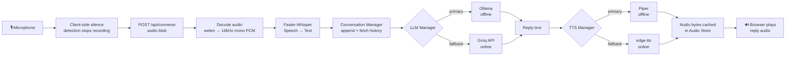

# Architecture

## Overview

VoiceAssistant is a request/response voice pipeline: the browser records
one user utterance at a time (auto-stopping on silence), sends it to the
backend, and receives back a transcript, a text reply, and a URL to the
synthesized reply audio. Conversation memory is kept per-session on the
server so multi-turn context works without a database.

## Pipeline

## Request Lifecycle

1. **Record**: `useAudioRecorder` captures mic audio via `MediaRecorder`. An `AnalyserNode` watches volume and auto-stops recording after ~900ms of near-silence — a client-side approximation of VAD that keeps the UX responsive without a WebSocket.
2. **Upload**: The recorded WebM blob is POSTed as multipart form data to `POST /api/converse`, along with the current `session_id` (or none, on the first turn).
3. **Decode**: `audio_utils.decode_audio_bytes` uses `pydub`/`ffmpeg` to convert whatever the browser sent into 16kHz mono float32 PCM.
4. **Transcribe**: `WhisperSTT.transcribe` runs Faster-Whisper (CPU, int8, greedy decoding) over the PCM buffer.
5. **Conversation context**: The transcript is appended to that session's in-memory history; the full (trimmed) history is fetched for the LLM call.
6. **Generate**: `LLMManager.generate_reply` tries the primary provider (Ollama by default) and transparently falls back to Groq on any failure or timeout.
7. **Synthesize**: `TTSManager.synthesize` tries Piper first, falling back to edge-tts if Piper's model files aren't installed or synthesis fails.
8. **Serve audio**: The synthesized bytes are cached in an in-memory `AudioStore` keyed by a UUID; the response includes `/api/audio/{id}` for the frontend to fetch and play.
9. **Fallback filler (client-side)**: If processing takes longer than ~1.2s, the frontend shows a rotating filler phrase ("Let me think about that...") in the transcript panel instead of a bare spinner, replaced by the real reply the moment it arrives.

## Fallback Pipeline

Every external dependency has a designed-in fallback so a single missing
piece (no GPU, no internet, no Ollama running) degrades gracefully instead
of crashing the conversation:

| Stage | Primary | Fallback | Trigger |
|-------|---------|----------|---------|
| LLM   | Ollama (offline) | Groq (online) | Ollama unreachable, errors, or times out (`LLM_TIMEOUT_SECONDS`) |
| TTS   | Piper (offline)  | edge-tts (online) | Piper model files missing or synthesis error |
| Final | —                | Apologetic scripted message | Both LLM providers fail |

If literally everything fails, the assistant still responds — briefly and
politely — rather than returning a raw HTTP error to a waiting user for
the LLM stage; TTS failures do surface as an HTTP error today since there
is no text-only fallback channel in a voice-first UI (see Known Limitations).

## Data Flow

- **State lives server-side, per session**: `ConversationManager` keeps an in-memory dict of `session_id -> Session(history)`. A sliding window (`LLM_MAX_HISTORY_TURNS`, default 10 turns) bounds prompt size and thus latency.
- **No database**: conversation memory only needs to survive one browser session; adding SQLite here would add setup complexity without a corresponding benefit, so it was deliberately left out (per the assignment's "keep it simple" requirement). The `Session` dataclass is structured so swapping in a persistence layer later is a small, contained change.
- **Audio never touches disk**: recorded audio is decoded in-memory; synthesized replies are cached in-memory with a 5-minute TTL and served by id.

## Design Decisions & Trade-offs

- **REST, not WebSocket streaming.** A single `POST /api/converse` per turn is simpler to reason about, test, and deploy than a bidirectional streaming protocol, at the cost of not being able to stream partial LLM tokens into partial TTS audio. Given the <2s target latency is achievable with small local models, this trade-off favors simplicity as instructed. The streaming upgrade path is straightforward: replace the REST call with a WebSocket that streams Ollama's token stream into sentence-chunked TTS calls.
- **Client-side silence detection instead of server-side Silero VAD in the hot path.** Silero VAD is included and available (`app/vad/silero_vad.py`) for server-side segmentation or batch analysis, but the live "when did the user stop talking" decision happens client-side via Web Audio API for lower latency (no network round-trip needed to detect silence).
- **Greedy decoding, small model sizes by default.** `beam_size=1` in Whisper and a 3B Ollama model are chosen as latency-first defaults; both are configurable via `.env` for accuracy-latency trade-offs.
- **In-memory everything.** No Redis, no message queue, no Kubernetes — a single FastAPI process handles VAD/STT/LLM/TTS orchestration directly, per the assignment's explicit "keep it simple" constraint.
