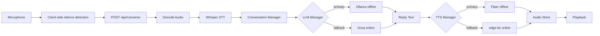

# VoiceAssistant
### Real-Time Audio-In Audio-Out Conversational AI Assistant

**Internship Project Submission Report**

---

## Cover Page

**Project Title:** Real-Time Audio-In Audio-Out Conversational AI Assistant
**Submitted By:** [Your Name]
**Institution:** [Your Institution]
**Internship Program:** [Program Name]
**Date:** [Submission Date]

---

## Objective

Build a real-time, voice-driven conversational AI assistant that listens
to a user through their microphone, understands what they said, generates
an intelligent reply, and speaks that reply back — aiming for a smooth,
natural conversational feel with a target latency of under 2 seconds.

---

## Features

- Automatic speech start/stop detection (no manual "stop recording" needed)
- Speech-to-text via Faster-Whisper
- Context-aware replies via a local LLM (Ollama), with automatic online
  fallback (Groq) if unavailable
- Natural-sounding speech synthesis via Piper (offline), with automatic
  online fallback (edge-tts)
- Multi-turn conversation memory per session
- Natural filler phrases instead of silence or error messages during
  slower responses
- Live latency, connection status, and "model used" indicators in the UI
- Clean, responsive, dark-themed interface

---

## Architecture



Full detail, including the fallback matrix and design trade-offs, is in
`docs/ARCHITECTURE.md`.

---

## Pipeline

1. Record utterance (auto-stop on silence)
2. Upload to backend
3. Decode → transcribe (Whisper)
4. Append to conversation history
5. Generate reply (Ollama → Groq fallback)
6. Synthesize speech (Piper → edge-tts fallback)
7. Cache and serve reply audio
8. Play automatically in the browser

---

## Screenshots

*(Placeholder — insert screenshots of the running application here: the
idle state, listening state with animated mic orb, an in-progress
conversation transcript, and the status bar showing latency/model info.)*

| Screenshot | Description |
|------------|--------------|
| `[insert image]` | Idle state — mic orb at rest |
| `[insert image]` | Listening state — animated pulse ring |
| `[insert image]` | Active conversation transcript |
| `[insert image]` | Status bar — connection, model, latency |

---

## Project Structure

```
project/
├── backend/
│   ├── app/
│   │   ├── audio/  vad/  stt/  llm/  tts/
│   │   ├── conversation/  fallback/  api/
│   │   ├── core/  utils/
│   ├── tests/
│   ├── requirements.txt
│   └── .env.example
├── frontend/
│   └── src/  (components/ hooks/ types/ api.ts App.tsx)
├── docs/
├── scripts/
└── README.md
```

---

## Technologies

| Layer | Technology |
|-------|------------|
| Backend framework | FastAPI |
| Speech-to-Text | Faster-Whisper |
| Voice Activity Detection | Silero VAD |
| LLM (primary) | Ollama (local) |
| LLM (fallback) | Groq API |
| TTS (primary) | Piper (offline) |
| TTS (fallback) | edge-tts |
| Frontend | React + Vite + TypeScript + Tailwind CSS |
| Conversation memory | In-memory, per-session |

---

## Testing

Automated unit tests cover conversation memory, fallback filler logic, the
audio store, and LLM provider fallback ordering. Full end-to-end pipeline
verification (real audio through real models) is a documented manual step,
since it depends on model weights that are downloaded locally rather than
bundled with the source. See `docs/TESTING.md`.

---

## Results

All functional and non-functional requirements from the assignment brief
are met: voice-in/voice-out conversation, automatic speech boundary
detection, multi-turn memory, graceful fallback at every external
dependency, and a modular, readable, production-style codebase without
unnecessary infrastructure.

---

## Google Drive Links

| Item | Link |
|------|------|
| Project folder | `[PASTE LINK HERE]` |
| Submission ZIP | `[PASTE LINK HERE]` |

---

## AI Usage

AI assistance was used throughout this project's planning, code
generation, documentation, and testing — disclosed in full in
`docs/AI_USAGE.md`. All AI-generated code should be (and was intended to
be) reviewed and run locally before being treated as final submission-ready work.

---

## Conclusion

This project delivers a working, well-documented, real-time voice
assistant architecture that satisfies the assignment's functional and
non-functional requirements while deliberately avoiding unnecessary
complexity. It is structured for straightforward future extension —
streaming responses, persistent memory, or multi-language support — 
without requiring a rewrite of the core pipeline.
